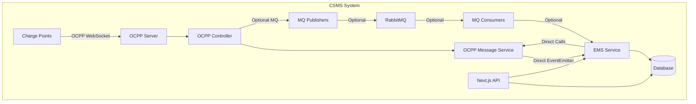
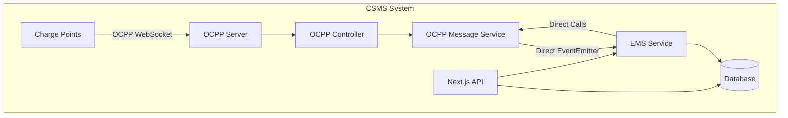

# Design Document

## Overview

This design outlines the removal of RabbitMQ message queue infrastructure from the charging station management system (CSMS). The system currently uses an optional RabbitMQ layer that is disabled by default and provides no critical functionality beyond what is already achieved through direct EventEmitter-based communication patterns.

The removal will eliminate all RabbitMQ components while preserving the existing event-driven architecture through Node.js EventEmitter patterns and direct service-to-service method calls. This simplification will reduce system complexity, eliminate unused dependencies, and maintain identical functionality.

## Architecture

### Current Architecture (Before Removal)



### Target Architecture (After Removal)



### Communication Flow Changes

**Before (with optional MQ):**
1. OCPP Event → OCPP Controller → OCPP Message Service → EventEmitter → EMS Service
2. OCPP Event → OCPP Controller → MQ Publisher → RabbitMQ → MQ Consumer → EMS Service (unused path)

**After (direct only):**
1. OCPP Event → OCPP Controller → OCPP Message Service → EventEmitter → EMS Service

## Components and Interfaces

### Components to Remove

#### 1. MQ Server Infrastructure
- **File**: `src/servers/mqServer.js`
- **Purpose**: RabbitMQ connection management and exchange setup
- **Removal Impact**: No functional impact as MQ is disabled by default

#### 2. OCPP Event Publishers
- **File**: `src/servers/publishers/ocppEventPublisher.js`
- **Purpose**: Publishes OCPP events to RabbitMQ exchanges
- **Removal Impact**: Events already handled by direct EventEmitter patterns

#### 3. OCPP Event Consumers
- **File**: `src/servers/consumers/ocppEventConsumer.js`
- **Purpose**: Consumes OCPP events from RabbitMQ queues
- **Removal Impact**: Event processing already handled by direct service calls

#### 4. EMS Event Publishers
- **File**: `src/servers/publishers/emsEventPublisher.js`
- **Purpose**: Publishes EMS events to RabbitMQ exchanges
- **Removal Impact**: EMS operations already use direct method calls

#### 5. EMS Event Consumers
- **File**: `src/servers/consumers/emsEventConsumer.js`
- **Purpose**: Consumes EMS events from RabbitMQ queues
- **Removal Impact**: EMS processing already handled directly

#### 6. MQ Configuration and Services
- **Files**: 
  - `src/servers/config/mqConfig.js`
  - `src/servers/services/mqService.js`
  - `src/servers/connectors/ocppMqConnector.js`
- **Purpose**: RabbitMQ configuration and service wrappers
- **Removal Impact**: No impact as these are unused when MQ is disabled

### Components to Modify

#### 1. EMS Service
- **File**: `src/servers/services/emsService.js`
- **Changes**: Remove MQ publishing calls, keep direct EventEmitter patterns
- **Preserved Functionality**: All power allocation and scheduling logic

#### 2. OCPP Controller
- **File**: `src/servers/controllers/ocppController.js`
- **Changes**: Remove MQ_ENABLED conditional logic and MQ publishing
- **Preserved Functionality**: All OCPP message handling and EventEmitter dispatch

#### 3. OCPP Server
- **File**: `src/servers/ocppServer.js`
- **Changes**: Remove MQ initialization calls
- **Preserved Functionality**: WebSocket server and connection management

#### 4. Package Dependencies
- **File**: `package.json`
- **Changes**: Remove `amqplib` dependency
- **Preserved Functionality**: All other dependencies remain unchanged

### Preserved Communication Patterns

#### 1. EventEmitter-Based Events
The system already uses Node.js EventEmitter for direct component communication:

```javascript
// Existing pattern (preserved)
import { EventEmitter } from 'events';
const eventBus = new EventEmitter();

// OCPP events trigger EMS operations
eventBus.emit('chargingStarted', { cpid, connectorId, data });
eventBus.on('chargingStarted', (eventData) => {
  // EMS handles power allocation
  emsService.scheduleGlobalPowerReallocation('charging_started', eventData);
});
```

#### 2. Direct Service Method Calls
Services already communicate through direct method invocation:

```javascript
// Existing pattern (preserved)
import * as emsService from '../services/emsService.js';
import * as ocppMessageService from '../services/ocppMessageService.js';

// Direct service calls for immediate operations
await emsService.configureStationPowerDistribution(cpids, options);
await ocppMessageService.sendChargingProfile(cpsn, connectorId, siteSetting);
```

## Data Models

### Event Data Structures (Unchanged)

The existing event data structures will remain identical:

```javascript
// OCPP Event Data (preserved)
const ocppEventData = {
  eventType: 'CHARGING_STARTED',
  cpid: 'CP001',
  cpsn: 'STATION001',
  connectorId: 1,
  timestamp: '2025-01-27T10:00:00Z',
  payload: { /* OCPP-specific data */ }
};

// EMS Event Data (preserved)
const emsEventData = {
  eventType: 'POWER_ALLOCATION_REQUEST',
  meterId: 'M001',
  stationId: 'S001',
  onlineCpids: ['CP001', 'CP002'],
  siteSetting: {
    ems_mode: 'dynamic',
    max_power_kw: 100
  }
};
```

### Database Models (Unchanged)

All database schemas and operations remain identical:
- Charging station records
- Transaction logs
- Power allocation history
- User and billing data

## Correctness Properties

*A property is a characteristic or behavior that should hold true across all valid executions of a system-essentially, a formal statement about what the system should do. Properties serve as the bridge between human-readable specifications and machine-verifiable correctness guarantees.*

Now I need to use the prework tool to analyze the acceptance criteria before writing the correctness properties:

### Property 1: EventEmitter Communication Preservation
*For any* OCPP event or charging status change, the system should use EventEmitter patterns for component communication and never attempt MQ publishing
**Validates: Requirements 3.2, 4.2, 5.1, 5.2**

### Property 2: Direct Service Communication
*For any* EMS power allocation request or immediate operation, the system should use direct function calls between services and never use message queue intermediaries
**Validates: Requirements 3.1, 4.3, 5.5**

### Property 3: Functional Equivalence
*For any* OCPP WebSocket connection, API endpoint call, or database operation, the system behavior should be identical to the pre-removal system functionality
**Validates: Requirements 4.1, 4.4, 4.5, 5.3, 5.4**

### Property 4: Performance Preservation
*For any* OCPP message processing, power allocation operation, or concurrent connection handling, the system should maintain performance characteristics within existing bounds
**Validates: Requirements 7.1, 7.2, 7.3, 7.4, 7.5**

### Property 5: End-to-End Integration
*For any* complete charging workflow from station connection through power allocation to profile delivery, the system should successfully complete all operations using direct communication patterns
**Validates: Requirements 8.2, 8.3, 8.4, 8.5**

## Error Handling

### Error Handling Strategy

The removal of RabbitMQ simplifies error handling by eliminating the complexity of message queue failures, connection issues, and asynchronous message processing errors.

#### Current Error Scenarios (Eliminated)
- RabbitMQ connection failures
- Message publishing failures
- Queue consumer errors
- Message serialization/deserialization errors
- Exchange and queue binding failures

#### Preserved Error Handling
- OCPP WebSocket connection errors
- Database operation failures
- EventEmitter listener errors
- Direct service method call exceptions
- Power allocation calculation errors

#### Error Handling Patterns

**Direct Method Call Errors:**
```javascript
try {
  await emsService.configureStationPowerDistribution(cpids, options);
} catch (error) {
  logger.error('Power allocation failed:', error);
  // Handle error directly without MQ retry mechanisms
}
```

**EventEmitter Error Handling:**
```javascript
eventBus.on('error', (error) => {
  logger.error('EventEmitter error:', error);
  // Direct error handling without MQ dead letter queues
});
```

## Testing Strategy

### Dual Testing Approach

The testing strategy combines unit tests for specific scenarios with property-based tests for comprehensive validation across all inputs.

#### Unit Testing Focus
- **File Removal Verification**: Test that all MQ-related files are completely removed
- **Import Statement Cleanup**: Verify no MQ imports remain in any service files
- **Startup Behavior**: Test clean system startup without MQ initialization
- **API Endpoint Preservation**: Verify all existing endpoints continue to work
- **Database Operation Continuity**: Test that all database operations remain functional

#### Property-Based Testing Focus
- **EventEmitter Communication**: Test that all event types use EventEmitter patterns across random event scenarios
- **Direct Service Calls**: Test that all service interactions use direct calls across various operation types
- **Functional Equivalence**: Test that system behavior is identical across all possible input combinations
- **Performance Preservation**: Test that performance characteristics remain within bounds across various load scenarios
- **End-to-End Integration**: Test complete workflows across random charging scenarios

#### Property Test Configuration
- **Testing Library**: Use `fast-check` for JavaScript property-based testing
- **Test Iterations**: Minimum 100 iterations per property test
- **Test Tags**: Each property test tagged with format: **Feature: rabbitmq-removal, Property {number}: {property_text}**

#### Test Implementation Examples

**Property Test for EventEmitter Usage:**
```javascript
// Feature: rabbitmq-removal, Property 1: EventEmitter Communication Preservation
test('EventEmitter communication across all event types', () => {
  fc.assert(fc.property(
    fc.record({
      eventType: fc.constantFrom('CHARGING_STARTED', 'CHARGING_STOPPED', 'STATUS_CHANGED'),
      cpid: fc.string(),
      data: fc.object()
    }),
    (eventData) => {
      const emitterSpy = jest.spyOn(eventBus, 'emit');
      const mqSpy = jest.spyOn(mqService, 'publishMessage');
      
      // Trigger event processing
      processOcppEvent(eventData);
      
      // Verify EventEmitter used, MQ not used
      expect(emitterSpy).toHaveBeenCalled();
      expect(mqSpy).not.toHaveBeenCalled();
    }
  ));
});
```

**Unit Test for File Removal:**
```javascript
test('MQ server file completely removed', () => {
  expect(fs.existsSync('src/servers/mqServer.js')).toBe(false);
});

test('No MQ imports in service files', () => {
  const serviceFiles = glob.sync('src/servers/services/*.js');
  serviceFiles.forEach(file => {
    const content = fs.readFileSync(file, 'utf8');
    expect(content).not.toMatch(/import.*mqService/);
    expect(content).not.toMatch(/require.*mqService/);
  });
});
```

### Integration Testing

**End-to-End Workflow Tests:**
1. **Charging Station Connection**: Verify OCPP WebSocket connections work without MQ
2. **Event Processing**: Test complete event flow from OCPP to EMS using EventEmitter
3. **Power Allocation**: Test power allocation workflows use direct service calls
4. **Profile Delivery**: Test charging profile delivery to stations works directly

**Performance Regression Tests:**
1. **Response Time Validation**: Measure and compare OCPP message response times
2. **Throughput Testing**: Verify concurrent connection handling capacity
3. **Memory Usage Monitoring**: Ensure memory usage patterns remain stable
4. **CPU Utilization Tracking**: Verify CPU usage stays within expected bounds

### Test Execution Strategy

**Pre-Removal Baseline:**
1. Run complete test suite to establish performance and functional baselines
2. Document all API response formats and timing characteristics
3. Record EventEmitter usage patterns and event flow timings

**Post-Removal Validation:**
1. Execute all unit tests to verify structural changes
2. Run property-based tests to validate behavioral preservation
3. Perform integration tests to ensure end-to-end functionality
4. Compare performance metrics against pre-removal baselines

**Continuous Validation:**
1. Include all tests in CI/CD pipeline
2. Set up performance monitoring to detect regressions
3. Implement automated checks for MQ-related code reintroduction
4. Monitor system logs for any MQ-related error messages